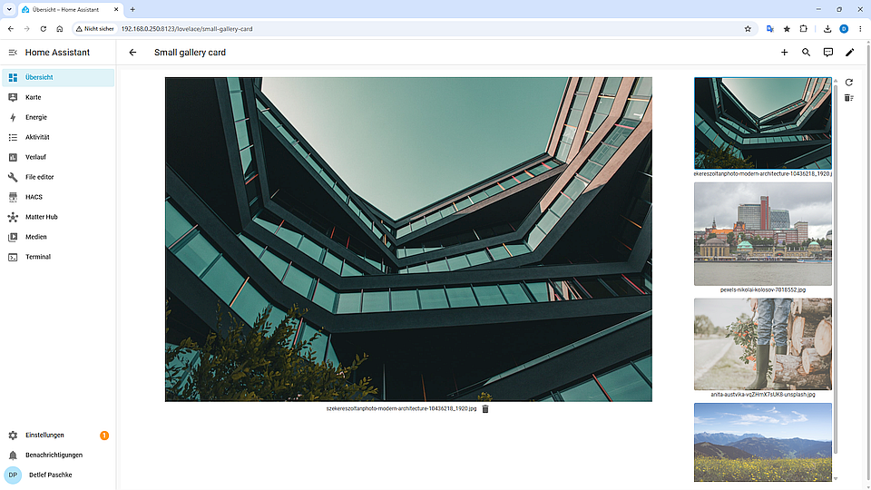

# Small Gallery Card

A slim, performant, and native gallery card for the Home Assistant dashboard to display and manage local images and videos from the Media Source.

---

## Preview



---

## Features

* **Image & Video Playback:** Native support for images (JPG, PNG, WebP, GIF) and videos (MP4, WebM, MOV) incl. HTML5 video player with controls.
* **Integrated File Management:** Delete individual files or all contained media directly via the dashboard.
* **Flexible Sorting:** Support for ascending (`asc`) and descending (`desc`) sorting by filename and date/time if included in the filename.
* **Full HACS Compatibility:** Can be used as a custom Lovelace repository.

---

## Installation & Setup

### 1. Backend Requirement (`configuration.yaml`)

The card uses a shell command to remove files, which must be specified in the `configuration.yaml` as follows:

```yaml
shell_command:
  del_gallery_file: "rm -f /media/{{ path }}"
```

> **Important:** After changing the `configuration.yaml`, Home Assistant must be restarted so that the service `shell_command.del_gallery_file` is available. The path prefix `/media/` corresponds to the standard Home Assistant media directory (`media-source://media_source/local/`).

---

### 2. Frontend Installation

#### Via HACS (Recommended)

1. Open **HACS** in your Home Assistant dashboard.
2. Click on the three-dot menu in the top right and select **Custom repositories**.
3. Enter the URL of this GitHub repository:
   * **URL:** `https://github.com/schabau/small-gallery-card`
   * **Category:** `Dashboard`
4. Click **Add** and then **Download**.
5. Reload your browser (Ctrl + F5) to activate the JavaScript module.

#### Manual Installation

1. Download the `small-gallery-card.js` file from this repository.
2. Copy the file into the local WWW directory of your Home Assistant server:
   ```text
   /config/www/small-gallery-card/small-gallery-card.js
   ```
3. Register the resource under **Settings** -> **Dashboards** -> **Three dots in the top right** -> **Resources**:
   * **URL:** `/local/small-gallery-card/small-gallery-card.js`
   * **Resource type:** `JavaScript Module`

---

## Dashboard Setup

To add the card to your Home Assistant interface:

1. **Open Dashboard Edit Mode:**
   * Open the dashboard where you want to display the card.
   * Click on the **three-dot menu** in the top right and select **Edit Dashboard**.
2. **Add New Card:**
   * Click the **+ Add Card** button in the bottom right.
3. **Select Manual Card:**
   * Scroll to the bottom of the 'By Card' tab to the community cards and select the **Small Gallery Card**.
4. **Insert Configuration:**
   * Replace the default example text with the following YAML code and customize it to your needs.

```yaml
type: custom:small-gallery-card
title: 'Camera Recordings'
media_path: media-source://media_source/local/
max_files: 20
sort_by: date
order: desc
date_format: YYYYMMDD-HHmmss
date_position: end
```

5. **Save:**
   * Click **Save** in the bottom right.
   * Exit edit mode in the top right by clicking **Done**.

---

### Configuration Parameters

| Parameter | Type | Required | Default | Description |
| :--- | :--- | :--- | :--- | :--- |
| `type` | String | **Yes** | - | Must be `custom:small-gallery-card`. |
| `title` | String | No | *empty* | Title in the card header. |
| `media_path` | String | **Yes** | - | Path to the Media Source, e.g., `media-source://media_source/local/folder_name`. |
| `max_files` | Number | No | 30 | Maximum number of files displayed in the preview without reloading. |
| `sort_by` | String | No | *name* | Sort by `name` or `date`. (If `date_format` is configured, it will automatically sort by `date`.) |
| `order` | String | No | `asc` | Sorting (`asc` from smallest to largest or newest date last; `desc` from largest to smallest or newest date first). |
| `date_format` | String | No | - | Format of the date string in the filename (e.g., YYMM, hhmm, YYYYMMDD_HHmmss, YYYY-MM-DD_HH-mm-ss) |
| `date_position` | String | No | - | Position of the date string in the filename, `start` or `end`. |

---

## User Guide

* **Select Media:** Click on a thumbnail in the right preview bar to display the image or video in the main area.
* **Video Playback:** Videos are automatically muted in the main area. You can control volume, pause, and full screen via the playback bar.
* **Delete Individual File:** Click on the trash icon below the main image/video. After confirmation, the file will be removed via the shell command and the view will be updated.
* **Delete All Files:** Click on the trash icon in the top right of the header. All loaded files will be deleted one by one.
* **Reload:** Click on the refresh icon in the top right to manually update the file list.

---

## License

This project is licensed under the [MIT License](LICENSE).
